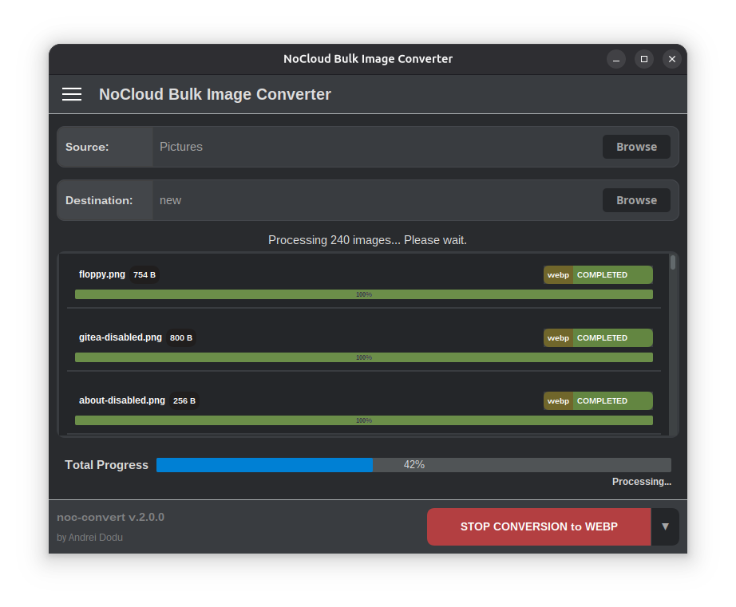

# NoCloud Bulk Image Converter v.2.0.1

<div id="introduction"> </div>

A fast, secure, and privacy-focused image converter designed to handle large-scale bulk conversions directly on your
desktop.

## Key Features

**NoCloud / Privacy-First:**
All conversion operations are executed **locally** on your device. Your files never leave your system, ensuring maximum
security and privacy.

**High-Performance Bulk Conversion & Parallel Processing:**

Process hundreds or even thousands of images quickly and efficiently. Optimized for speed and utilizing **parallel
processing** (multithreading) to leverage multi-core CPUs, the application is ideal for automating heavy image workflows
for designers, photographers, and developers.

**Intuitive Graphical User Interface (GUI) with Real-Time Feedback:**

Designed for ease of use, making complex bulk conversions simple with just a few clicks. The interface provides *
*real-time progress bars** (individual and total) to indicate the current status of the job.

**Comprehensive Format Support:**

Supports a broad and detailed array of common and professional image formats, including:

* **Raster Formats:** JPG/JPEG, PNG, GIF, BMP, WEBP, TGA, ICO, IFF.
* **Professional Formats:** TIFF (incl. BIGTIFF), PSD, PSB.
* **Portable Formats:** PAM, PBM, PGM, PFM, PNM, PPM.
* **Specialty/Legacy:** ICNS, PCT/PICT, WBMP.

**Portable and Secure:**

The application does not require an internet connection to function, making it completely independent and reliable
anywhere.

---

## Screenshot



## Download

<div id="download">v.2.0.1</div>

| Platform    | AMD 64-bit                                                                                                                  | ARM 64-bit                                                                                                                |
|:------------|:----------------------------------------------------------------------------------------------------------------------------|:--------------------------------------------------------------------------------------------------------------------------|
| **Linux**   | [zip (.deb)](https://github.com/goto-eof/noc-convert/releases/download/2.0.1/noc-convert-Linux-2.0.1-amd64-Installer.zip)   | [App Center (amd64/arm64 snap)](https://snapcraft.io/noc-convert)                                                         |
| **Windows** | [zip (.msi)](https://github.com/goto-eof/noc-convert/releases/download/2.0.1/noc-convert-Windows-2.0.1-amd64-Installer.zip) | N/A                                                                                                                       |
| **macOS**   | [zip (.pkg)](https://github.com/goto-eof/noc-convert/releases/download/2.0.1/noc-convert-MacOS-2.0.1-amd64-Installer.zip)   | [zip (.pkg)](https://github.com/goto-eof/noc-convert/releases/download/2.0.1/noc-convert-MacOS-2.0.1-arm64-Installer.zip) |

## Installation and Usage

### Ubuntu Installation (Snap)

The application is available on the **Ubuntu App Center** (Snap Store) and is the easiest way to install and keep it
updated:

```bash
sudo snap install noc-convert
```

### Graphical Launch (GUI)

Once installed, simply search for **"NoCloud Bulk Image Converter"** in your system's applications menu and launch it.

### Terminal Launch

While the app is primarily a graphical utility, you can also launch the GUI directly from the terminal:

```bash
noc-convert
```

---


## Contributing and Support

If you find a bug, have a suggestion, or want to contribute code, your help is welcome!

* **Bug Reports:** Please report any issues via
  the [GitHub Issues page](https://github.com/goto-eof/noc-convert/issues).

### Donations

This open-source project is maintained in my spare time. If you find **NoCloud Bulk Image Converter** useful, please
consider supporting development via [GitHub Sponsors](https://github.com/sponsors/goto-eof).

---

## License

This project is licensed under the [CC-BY-NC-4.0 license](https://creativecommons.org/licenses/by-nc/4.0/deed.en).
