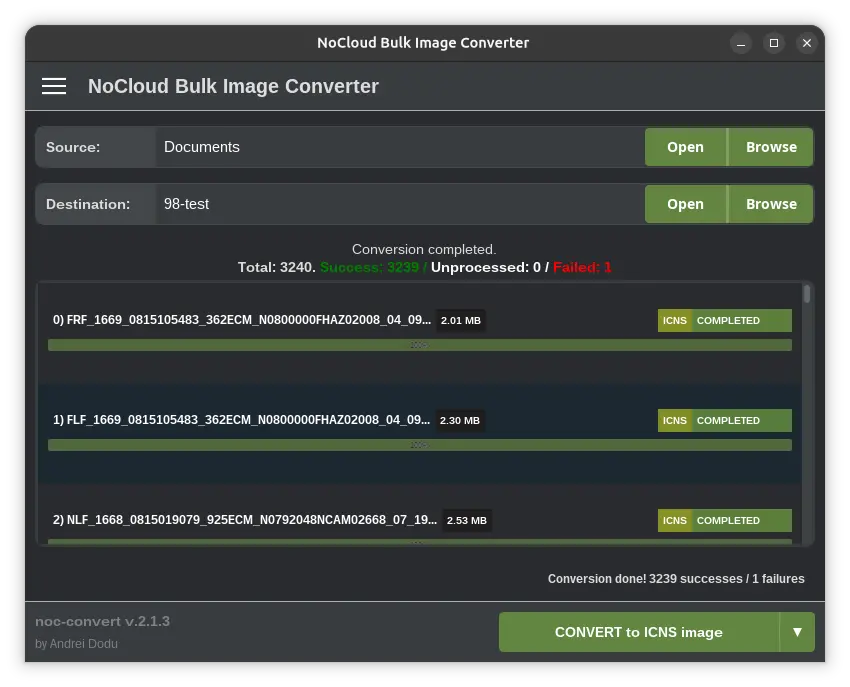

# NoCloud Bulk Image Converter v.2.1.26 (aka noc-convert)

<div id="introduction"> </div>

A fast, secure, and privacy-focused image converter designed to handle large-scale bulk conversions directly on your
desktop.

## Key Features

**NoCloud / Privacy-First:**
All conversion operations are executed **locally** on your device. Your files never leave your system, ensuring maximum
security and privacy.

**High-Performance Bulk Conversion & Parallel Processing:**

Process hundreds or even thousands of images quickly and efficiently. Optimized for speed and utilizing **parallel
processing** (multithreading) to leverage multi-core CPUs, the application is ideal for automating heavy image workflows
for designers, photographers, and developers.

**Intuitive Graphical User Interface (GUI) with Real-Time Feedback:**

Designed for ease of use, making complex bulk conversions simple with just a few clicks. The interface provides *
*real-time progress bars** (individual and total) to indicate the current status of the job.

**Format Compatibility (Input/Output)**

NocConvert is engineered to support a comprehensive ecosystem of image formats, ensuring your files can always be read
and written with maximum fidelity—from common web formats to professional and scientific standards.

- Input Formats
  These are all the formats the application can read and use as a source file for conversion:
    - Standard Raster: Basic, widely used formats for every day and web use.
        - Key Formats: JPG, PNG, GIF, BMP, WEBP, WMF.
    - Professional Grade: High-fidelity support for editing, design, and high resolution.
        - Key Formats: PSD, PSB (Adobe Photoshop), TIFF, BIGTIFF, HDR, PCX, XWD.
    - Scientific/Raw: NetPBM family and derivatives for technical data and portability.
        - Key Formats: PAM, PBM, PGM, PFM, PNM, PPM, RGBE.
    - Legacy & System: Historical formats and specific operating system icons/files.
        - Key Formats: ICO, ICNS, CUR, PICT, IFF, TGA/TARGA, DCX, PCT, PNTG, SGI.
    - Variants: Support for specific and lossless formats.
        - Key Formats: JPEG-LOSSLESS, THUMBS, SVG.


- Output Formats
  These are all the formats the application can write to and save the conversion result:
    - Standard Raster: Ideal for final export, distribution, and web use.
        - Key Formats: JPG, PNG, GIF, BMP, WEBP.
    - Professional Grade: Perfect for lossless archiving and further processing.
        - Key Formats: PSD, PSB, TIFF, BIGTIFF.
    - Portable Formats: Raw and compatible output for external data pipelines.
        - Key Formats: PAM, PBM, PGM, PFM, PNM, PPM.
    - Legacy & System: For integration into specific systems and archives.
        - Key Formats: ICO, ICNS, PICT, IFF, TGA/TARGA, PCT.

In Summary: NocConvert ensures that virtually any file you own can be converted to your desired target format,
delivering maximum quality and flexibility for all your imaging needs.

**Portable and Secure:**

The application does not require an internet connection to function, making it completely independent and reliable
anywhere.

---

## Screenshot



## Download

<div id="download">v.2.1.26</div>

| Platform    | AMD 64-bit                                                                                                                                  | ARM 64-bit                                                                                                                                |
|:------------|:--------------------------------------------------------------------------------------------------------------------------------------------|:------------------------------------------------------------------------------------------------------------------------------------------|
| **Linux**   | [zip (.deb)](https://andre-i.eu/api/v1/download?filePath=noc-convert/releases/download/2.1.26/noc-convert-Linux-2.1.26-amd64-Installer.zip)   | [App Center (amd64/arm64 snap)](https://snapcraft.io/noc-convert)                                                                         |
| **Windows** | [zip (.msi)](https://andre-i.eu/api/v1/download?filePath=noc-convert/releases/download/2.1.26/noc-convert-Windows-2.1.26-amd64-Installer.zip) | N/A                                                                                                                                       |
| **macOS**   | [zip (.pkg)](https://andre-i.eu/api/v1/download?filePath=noc-convert/releases/download/2.1.26/noc-convert-MacOS-2.1.26-amd64-Installer.zip)   | [zip (.pkg)](https://andre-i.eu/api/v1/download?filePath=noc-convert/releases/download/2.1.26/noc-convert-MacOS-2.1.26-arm64-Installer.zip) |

## Installation and Usage

### Ubuntu Installation (Snap)

The application is available on the **Ubuntu App Center** (Snap Store) and is the easiest way to install and keep it
updated:

```bash
sudo snap install noc-convert
```

### Graphical Launch (GUI)

Once installed, simply search for **"NoCloud Bulk Image Converter"** in your system's applications menu and launch it.

### Terminal Launch

While the app is primarily a graphical utility, you can also launch the GUI directly from the terminal:

```bash
noc-convert
```

---

### Integration Tests

```bash
mvn verify
```

---


## Contributing and Support

If you find a bug, have a suggestion, or want to contribute code, your help is welcome!

* **Bug Reports:** Please report any issues via
  the [GitHub Issues page](https://github.com/goto-eof/noc-convert/issues).

### Donations

This open-source project is maintained in my spare time. If you find **NoCloud Bulk Image Converter** useful, please
consider supporting development via [GitHub Sponsors](https://github.com/sponsors/goto-eof).

---

## License

This project is licensed under the [CC-BY-NC-4.0 license](https://creativecommons.org/licenses/by-nc/4.0/deed.en).
